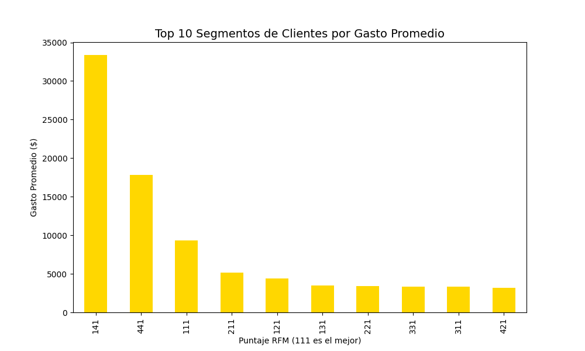
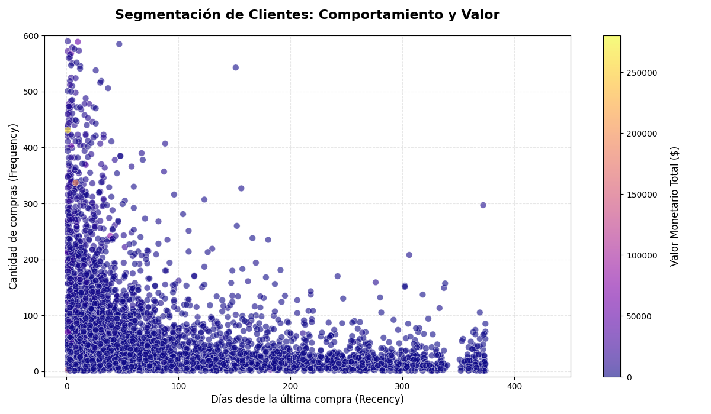

# 🛒 CAPÍTULO 1:Inteligencia de Ventas: Predicción de Intención de Compra en E-commerce

### 🕵️ El Desafío del Negocio
¿Por qué el 84% de los usuarios abandona la tienda sin comprar? Analizamos **12,330 sesiones de navegación** para identificar los patrones que convierten a un "visitante mirón" en un "comprador real". El objetivo es optimizar la tasa de conversión (CRO) y reducir el abandono de carrito.

### 🔍 Hallazgos Estratégicos (Insights):
1.  **El Mes de Oro:** **Noviembre** lidera la intención de compra, impulsado por eventos globales de descuentos. 👑🗓️
2.  **La Paradoja del Visitante:** Sorprendentemente, los **Nuevos Visitantes** tienen una tasa de conversión del **24.9%**, casi el doble que los recurrentes (14%). ¡La primera impresión es la que vende! 😍💸
3.  **El Valor de la Página:** Los compradores reales navegan por páginas con un `PageValue` **14 veces superior** al de los que abandonan.

### 📊 Evidencias Visuales de Conversión:

#### 1. Estacionalidad de Ventas por Mes

#### 2. ¿Qué "mira" la IA antes de una compra? (Feature Importance)

*Análisis Técnico: El **PageValues** y el **ExitRates** dominan el 70% de la decisión. El modelo detecta cuándo el usuario está a punto de abandonar o cerrar la transacción.*

---

### 💡 Recomendación de Negocio (ROI)
**Se recomienda implementar disparadores de ofertas (Exit-Intent Popups) cuando la IA detecte niveles altos de ExitRates en páginas de alto valor. Además, enfocar el presupuesto de marketing en la captación de tráfico nuevo durante Noviembre para maximizar el retorno de inversión.**

---

### ⚙️ Especificaciones Técnicas
*   **Motor de IA:** Random Forest Classifier con balanceo de clases.
*   **Métricas:** 89% Accuracy Global.

  
--------

# 💎 CAPÍTULO 2: Segmentación de Clientes de Alto Valor (RFM)

### 🕵️ El Desafío: "¿Quiénes son mis clientes reales?"
En un océano de 541,000 transacciones, el objetivo fue identificar micro-segmentos de clientes basados en su comportamiento de compra (Recency, Frequency, Monetary).

### 🔍 Hallazgos de Inteligencia de Negocio:
1.  **Segmento 111 (Champions):** Identificamos un grupo de élite que compra con alta frecuencia y gasto superior. 🏆
2.  **Fuga de Capital:** Detectamos clientes "Ballena" (alto gasto) que no han regresado en más de 300 días.
3.  **Potencial de Crecimiento:** El 25% de la base de clientes son "Nuevos Prometedores" con Recency bajo pero Frequency aún en desarrollo.

### 📊 Evidencias Visuales:

### 💡 Recomendación Estratégica (ROI)
**Implementar un programa de fidelización exclusivo para el segmento 111 para asegurar su retención. Simultáneamente, lanzar una campaña de 'Reactivación VIP' para los clientes de alto gasto con Recency > 200 días para recuperar capital dormido.**
