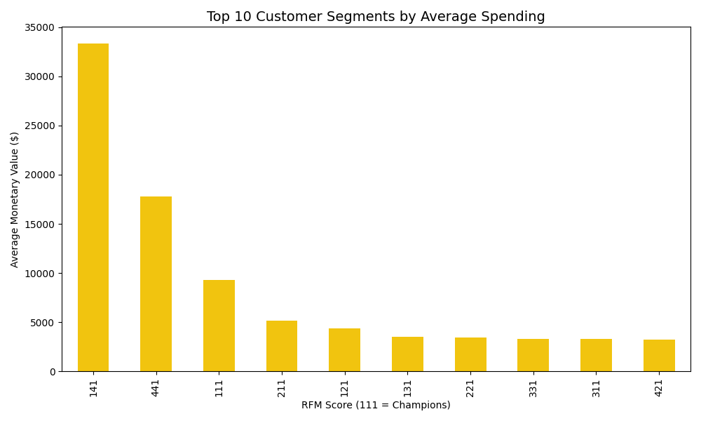

# 🛒 CAPÍTULO 1: Inteligencia de Ventas: Predicción de Intención de Compra en E-commerce

### 📊 Strategic Visual Insights (E-commerce Analysis)
- **Sales Seasonality:** [Monthly conversion ranking and peak performance](01_monthly_conversion_ranking.png)
- **Page Value Impact:** [Browsing behavior: Buyers vs Non-Buyers](02_page_value_impact.png)
- **Predictive Logic:** [Key indicators of purchase intent (AI features)](03_purchase_intent_features.png)
- **Loyalty Segments:** [Customer segmentation by engagement and RFM score](04_rfm_customer_segments.png)

### 🕵️ The Business Challenge (ROI Focus)
Why do 84% of users abandon the store without purchasing? We analyzed 12,330 web sessions to identify key conversion patterns. The goal is to optimize the Customer Journey and maximize Return on Investment (ROI) through Artificial Intelligence.

### ### 🔍 Strategic Insights & Business Intelligence:
1. **Purchase Seasonality:** **November** leads conversion rates due to global discount events. 🗓️💎
2. **The New Visitor Paradox:** New visitors show a **24.9% conversion rate**, significantly higher than returning customers. First impressions drive the revenue. 🚀💸
3. **High-Value Navigation:** Buyers browse pages with a **PageValue 14x higher** than those who abandon the cart.
4. **Loyalty Segments:** Our **RFM analysis** identifies "Champion" segments that sustain the store's long-term profitability. 👑📊

### ### 📊 Strategic Visual Evidence (Executive Dashboard):

#### 1. Sales Seasonality & Monthly Ranking

*Insight: Focus marketing budget on peak months to maximize conversion.*

#### 2. Page Value Impact: Buyers vs. Non-Buyers

*Insight: High PageValue is the strongest indicator of an imminent purchase.*

#### 3. AI Predictive Logic (Feature Importance)

*Technical Analysis: ExitRates and PageValues dominate 70% of the AI's decision-making process.*

#### 4. Customer Loyalty & RFM Segmentation

*Strategy: Target "At-Risk" segments with personalized retention offers.*

*📊 Technical Analysis (Feature Importance)
PageValues and ExitRates account for 70% of the model's decision-making process. The AI effectively detects when a user is likely to bounce or successfully complete a transaction.*

---

### 💡 Business Recommendation (ROI)

**We recommend implementing **Exit-Intent Popups (special offers)** triggered when the AI detects high ExitRates on high-value pages. Additionally, marketing budgets should be focused on **New Visitor acquisition** during November to capitalize on seasonal conversion peaks and maximize ROI.**

---

### ⚙️ Technical Specifications & Deployment
* **Machine Learning Engine:** Random Forest Classifier (Class-Balanced).
*   **Key Metrics:** 89% Global Accuracy / High Precision in Purchase Intent.
*   **Frameworks:** Python (Pandas, Scikit-Learn), Behavioral Labeling (RFM).

*   ##### ✨ **Technical Note** 
##### The trained model file (.pkl) is not included in this repository due to GitHub file size limits and security protocols. However, it is available for deployment in controlled environments upon request.

  
--------

# 💎 CHAPTER 2: High-Value Customer Segmentation (RFM Analysis)

### 🕵️ The Business Challenge: "Who are my real customers?"
In a sea of **541,000 transactions**, the goal was to identify micro-segments of customers based on their purchasing behavior: **Recency, Frequency, and Monetary (RFM)**.

### 🔍 Business Intelligence Insights:
1. **Segment 111 (Champions):** Identified an elite group with high purchase frequency and superior spending. 🏆
2. **Capital Leakage:** Detected "Whale" customers (high spenders) who haven't returned in over 300 days.
3. **Growth Potential:** 25% of the customer base are "Promising Newbies" with low Recency but developing Frequency.

### 📊 Strategic Visual Insights:
This analysis categorizes the customer base into real value groups to drive targeted marketing strategies.

- **Segmentation Power:** [Top 10 customer segments by average spending](01_customer_segments_spending.png)
- **Behavioral Patterns:** [Customer Behavior Heatmap: Recency vs. Frequency](02_customer_behavior_heatmap.png)

### 🖼️ Visual Evidence:

*Insight: Identifying the '111' Champions allows for exclusive loyalty programs.*

*Technical Analysis: Bright spots represent the highest **Customer Lifetime Value (LTV)**. The chart reveals the density of active customers versus their purchase frequency.*

---

### 💡 Strategic Recommendation (ROI)
**Implement an exclusive loyalty program for Segment 111 to ensure retention. Simultaneously, launch a 'VIP Reactivation' campaign for high-spending customers with Recency > 200 days to recover dormant capital.**

---

### ⚙️ Technical Specifications
* **Methodologies:** Behavioral Segmentation (RFM Analysis).
* **Data Processing:** Outlier handling in visual axes and CustomerID null cleansing.
* **Tools:** Python (Pandas, Matplotlib, Seaborn).

  
##### ✨ Technical Note
The processed dataset and model logic are documented for scalability but (.pkl) files are excluded from this repository due to security protocols and file size limits. They are available for deployment in controlled environments
