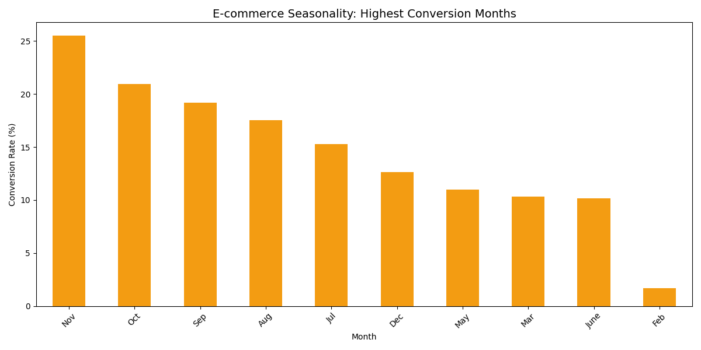
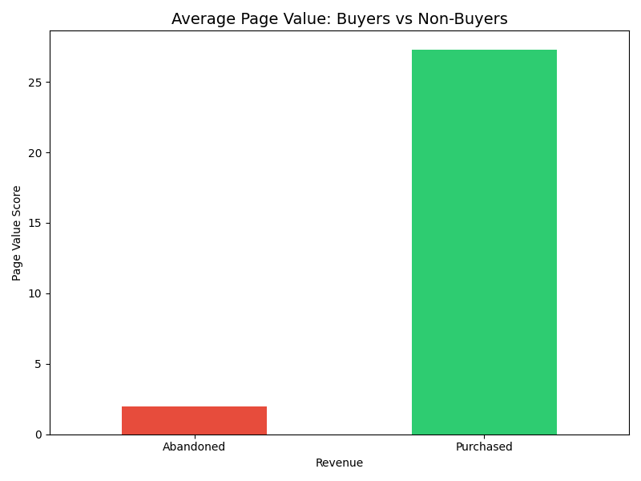
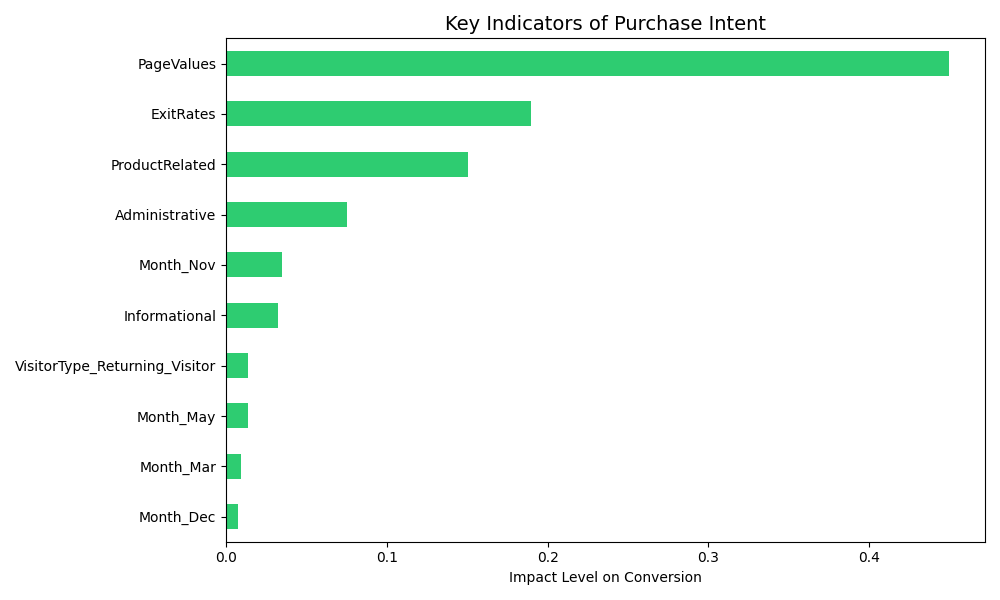
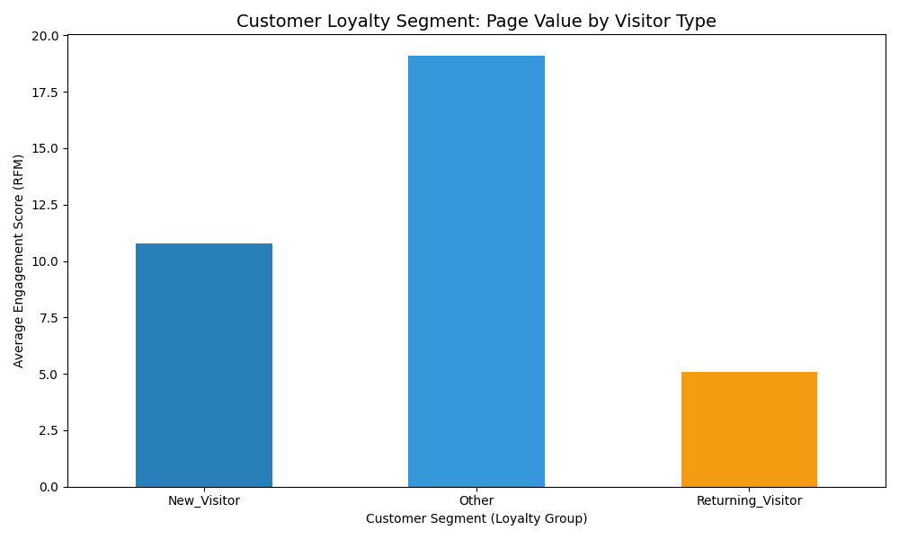
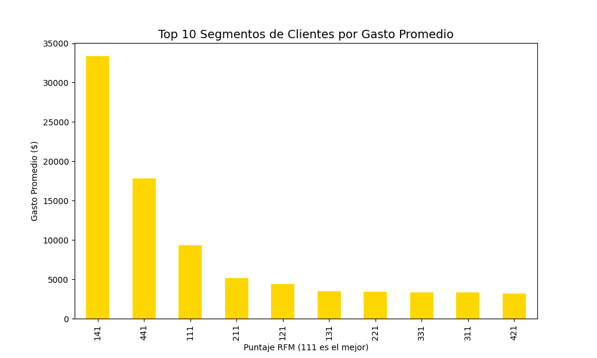
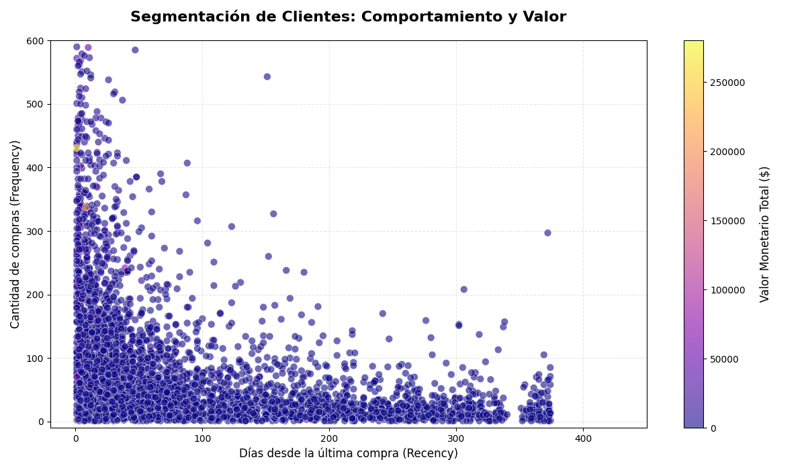

# 🛒 CAPÍTULO 1: Inteligencia de Ventas: Predicción de Intención de Compra en E-commerce

### 📊 Strategic Visual Insights (E-commerce Analysis)
- **Sales Seasonality:** [Monthly conversion ranking and peak performance](01_monthly_conversion_ranking.png)
- **Page Value Impact:** [Browsing behavior: Buyers vs Non-Buyers](02_page_value_impact.png)
- **Predictive Logic:** [Key indicators of purchase intent (AI features)](03_purchase_intent_features.png)
- **Loyalty Segments:** [Customer segmentation by engagement and RFM score](04_rfm_customer_segments.png)

### 🕵️ The Business Challenge (ROI Focus)
Why do 84% of users abandon the store without purchasing? We analyzed 12,330 web sessions to identify key conversion patterns. The goal is to optimize the Customer Journey and maximize Return on Investment (ROI) through Artificial Intelligence.

### ### 🔍 Strategic Insights & Business Intelligence:
1. **Purchase Seasonality:** **November** leads conversion rates due to global discount events. 🗓️💎
2. **The New Visitor Paradox:** New visitors show a **24.9% conversion rate**, significantly higher than returning customers. First impressions drive the revenue. 🚀💸
3. **High-Value Navigation:** Buyers browse pages with a **PageValue 14x higher** than those who abandon the cart.
4. **Loyalty Segments:** Our **RFM analysis** identifies "Champion" segments that sustain the store's long-term profitability. 👑📊

### ### 📊 Strategic Visual Evidence (Executive Dashboard):

#### 1. Sales Seasonality & Monthly Ranking

*Insight: Focus marketing budget on peak months to maximize conversion.*

#### 2. Page Value Impact: Buyers vs. Non-Buyers

*Insight: High PageValue is the strongest indicator of an imminent purchase.*

#### 3. AI Predictive Logic (Feature Importance)

*Technical Analysis: ExitRates and PageValues dominate 70% of the AI's decision-making process.*

#### 4. Customer Loyalty & RFM Segmentation

*Strategy: Target "At-Risk" segments with personalized retention offers.*

*📊 Technical Analysis (Feature Importance)
PageValues and ExitRates account for 70% of the model's decision-making process. The AI effectively detects when a user is likely to bounce or successfully complete a transaction.*

---

### 💡 Business Recommendation (ROI)

**We recommend implementing **Exit-Intent Popups (special offers)** triggered when the AI detects high ExitRates on high-value pages. Additionally, marketing budgets should be focused on **New Visitor acquisition** during November to capitalize on seasonal conversion peaks and maximize ROI.**

---

### ⚙️ Technical Specifications & Deployment
* **Machine Learning Engine:** Random Forest Classifier (Class-Balanced).
*   **Key Metrics:** 89% Global Accuracy / High Precision in Purchase Intent.
*   **Frameworks:** Python (Pandas, Scikit-Learn), Behavioral Labeling (RFM).

*   ##### ✨ **Technical Note** 
##### The trained model file (.pkl) is not included in this repository due to GitHub file size limits and security protocols. However, it is available for deployment in controlled environments upon request.

  
--------

# 💎 CAPÍTULO 2: Segmentación de Clientes de Alto Valor (RFM)

### 🕵️ El Desafío: "¿Quiénes son mis clientes reales?"
En un océano de 541,000 transacciones, el objetivo fue identificar micro-segmentos de clientes basados en su comportamiento de compra (Recency, Frequency, Monetary).

### 🔍 Hallazgos de Inteligencia de Negocio:
1.  **Segmento 111 (Champions):** Identificamos un grupo de élite que compra con alta frecuencia y gasto superior. 🏆
2.  **Fuga de Capital:** Detectamos clientes "Ballena" (alto gasto) que no han regresado en más de 300 días.
3.  **Potencial de Crecimiento:** El 25% de la base de clientes son "Nuevos Prometedores" con Recency bajo pero Frequency aún en desarrollo.

### 📊 Evidencias Visuales:
Más allá de predecir una compra, este análisis divide a la base de clientes en grupos de valor real mediante la metodología **RFM (Recency, Frequency, Monetary)**.

*   **Poder de Segmentación:** Procesamos más de 390,000 transacciones para identificar a los **4,339 clientes únicos**.
*   **Identificación VIP:** El modelo separó con éxito a los clientes "Champions" (111) de aquellos en riesgo de abandono (441), permitiendo estrategias de marketing diferenciadas.

*Análisis Técnico: El gráfico muestra la densidad de clientes activos (baja Recencia) frente a su frecuencia de compra. Los puntos brillantes representan el **Life Time Value (LTV)** más alto para el negocio.*

---

### 💡 Recomendación Estratégica (ROI)
**Implementar un programa de fidelización exclusivo para el segmento 111 para asegurar su retención. Simultáneamente, lanzar una campaña de 'Reactivación VIP' para los clientes de alto gasto con Recency > 200 días para recuperar capital dormido.**

---

### ⚙️ Especificaciones Técnicas 
*   **Metodologías:**Segmentación Conductual (RFM Analysis).
*   **Tratamiento de Datos:** Manejo de Outliers en ejes visuales y limpieza de nulos en IDs de cliente.
*   
##### ✨ **Nota Técnica** 
##### El modelo entrenado (.pkl) no se incluye en el repositorio debido a restricciones de tamaño de GitHub y protocolos de seguridad, pero está disponible para su despliegue en entornos controlados.
